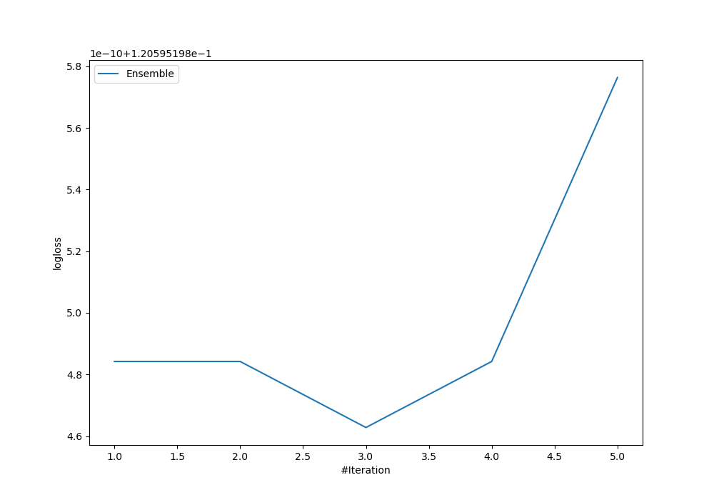
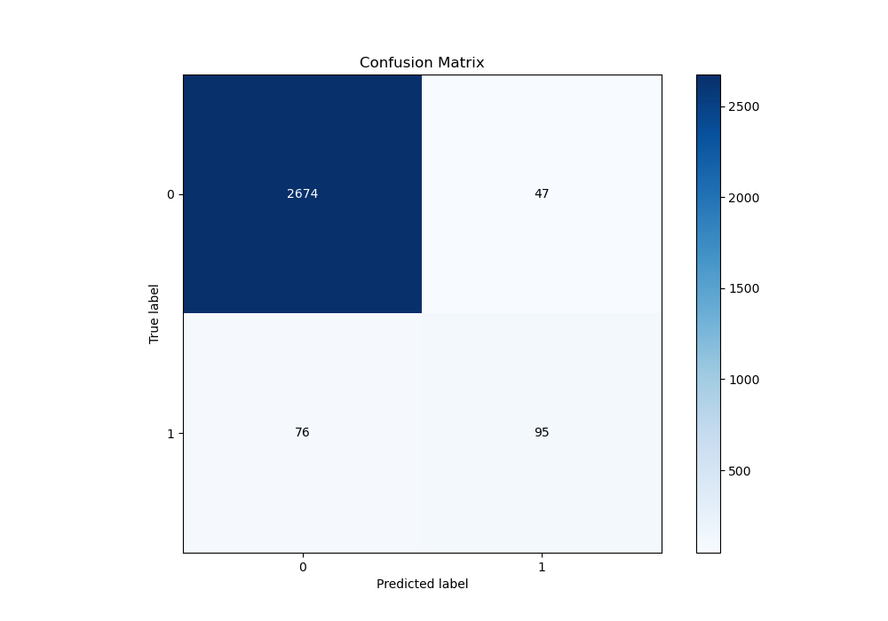
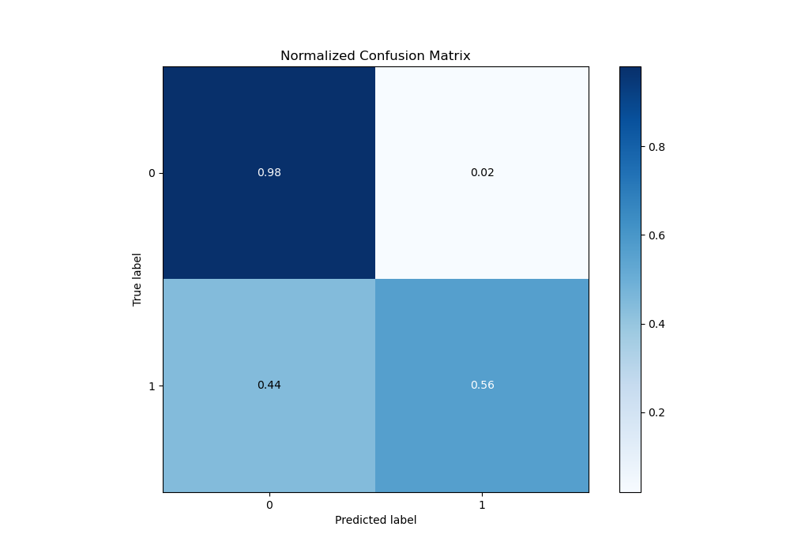
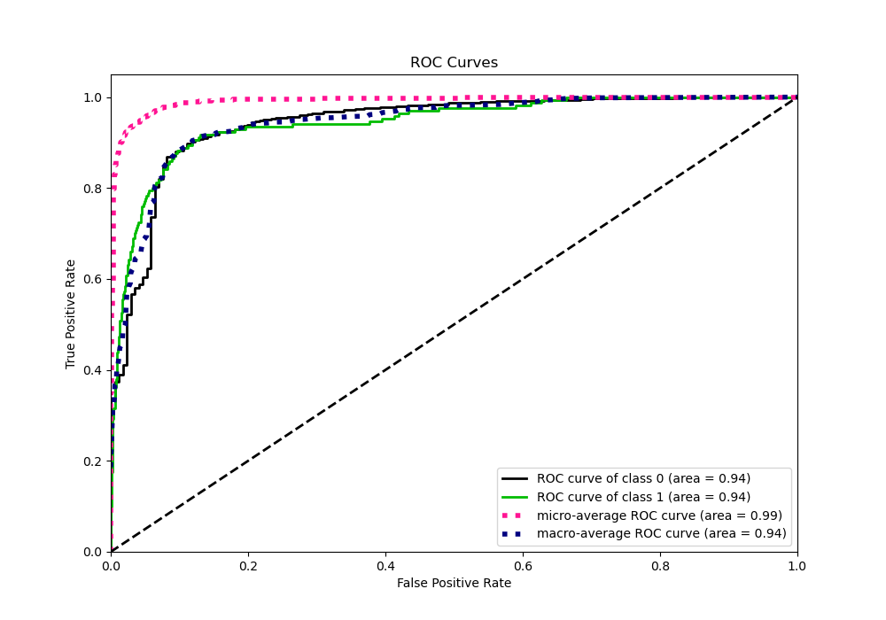
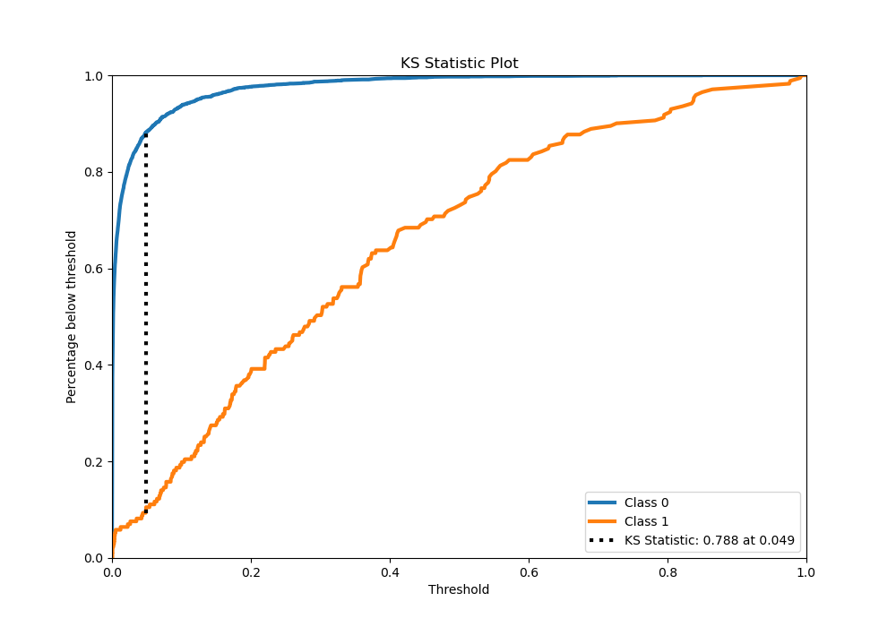
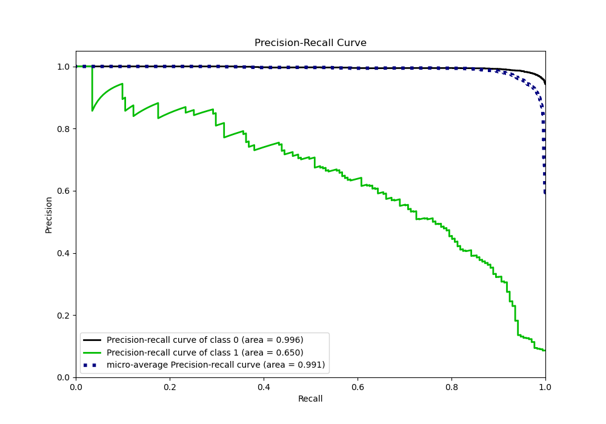
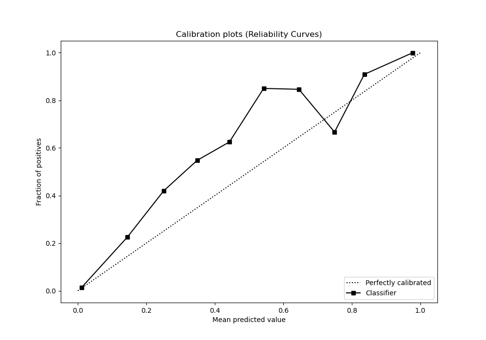
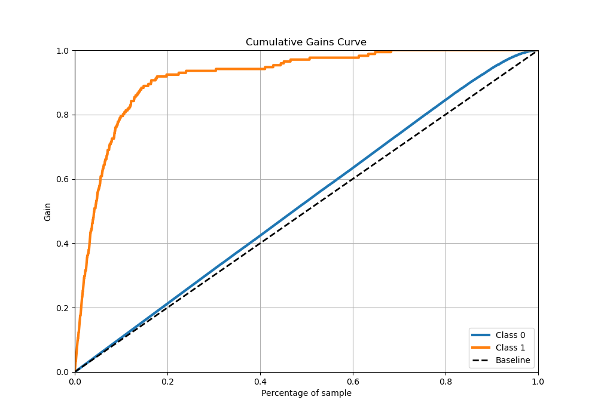
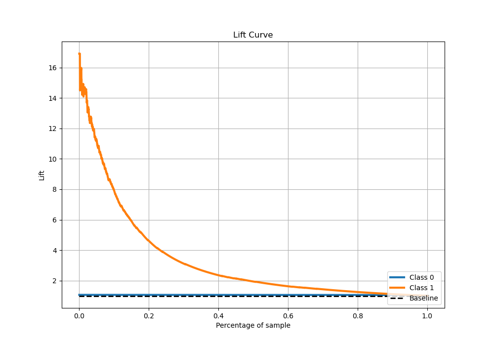

# Summary of Ensemble

[<< Go back](../README.md)

## Ensemble structure
| Model             |   Weight |
|:------------------|---------:|
| 3_Default_Xgboost |        3 |

## Metric details
|           |    score |     threshold |
|:----------|---------:|--------------:|
| logloss   | 0.120595 | nan           |
| auc       | 0.943893 | nan           |
| f1        | 0.625    |   0.184856    |
| accuracy  | 0.957469 |   0.258612    |
| precision | 0.822581 |   0.460667    |
| recall    | 1        |   3.77558e-06 |
| mcc       | 0.600995 |   0.184856    |

## Metric details with threshold from accuracy metric
|           |    score |   threshold |
|:----------|---------:|------------:|
| logloss   | 0.120595 |  nan        |
| auc       | 0.943893 |  nan        |
| f1        | 0.607029 |    0.258612 |
| accuracy  | 0.957469 |    0.258612 |
| precision | 0.669014 |    0.258612 |
| recall    | 0.555556 |    0.258612 |
| mcc       | 0.587573 |    0.258612 |

## Confusion matrix (at threshold=0.258612)
|              |   Predicted as 0 |   Predicted as 1 |
|:-------------|-----------------:|-----------------:|
| Labeled as 0 |             2674 |               47 |
| Labeled as 1 |               76 |               95 |

## Learning curves

## Confusion Matrix

## Normalized Confusion Matrix

## ROC Curve

## Kolmogorov-Smirnov Statistic

## Precision-Recall Curve

## Calibration Curve

## Cumulative Gains Curve

## Lift Curve

[<< Go back](../README.md)
