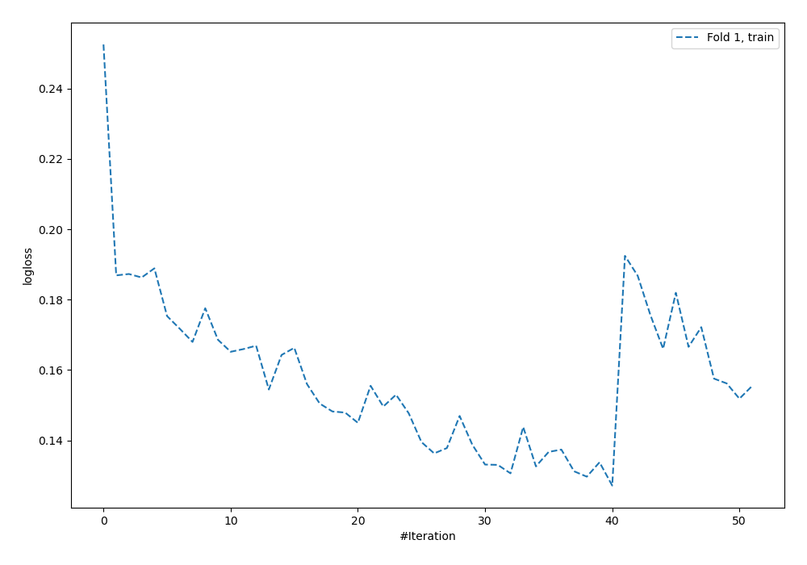
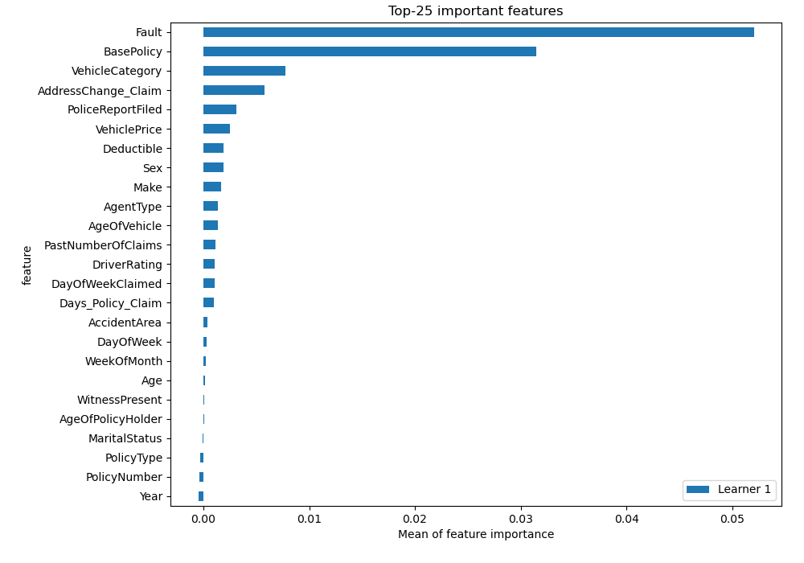
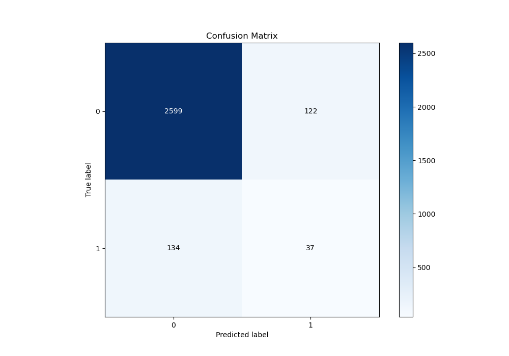
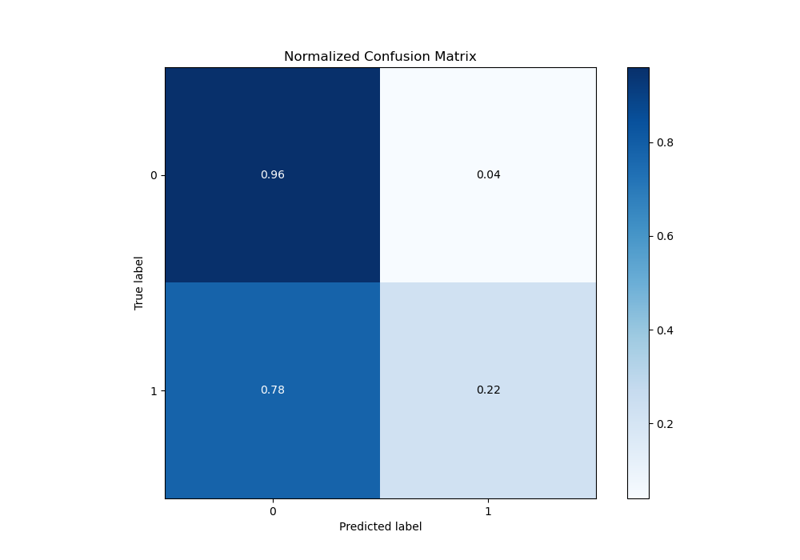
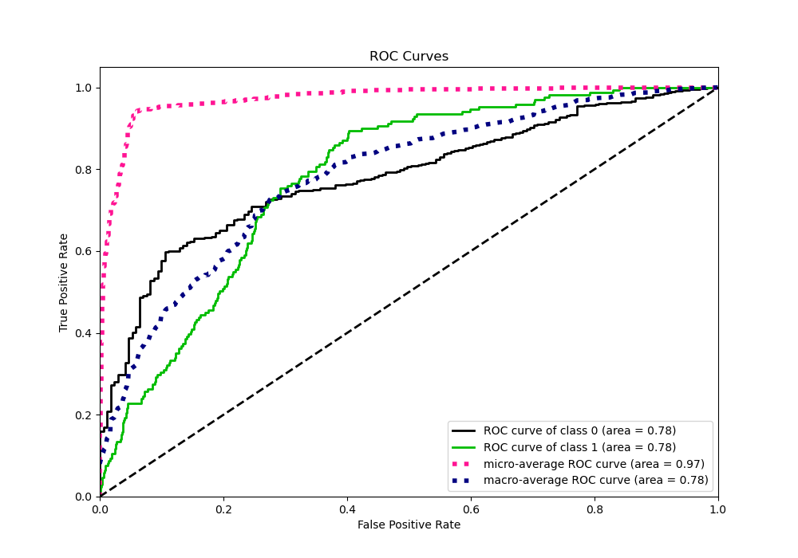
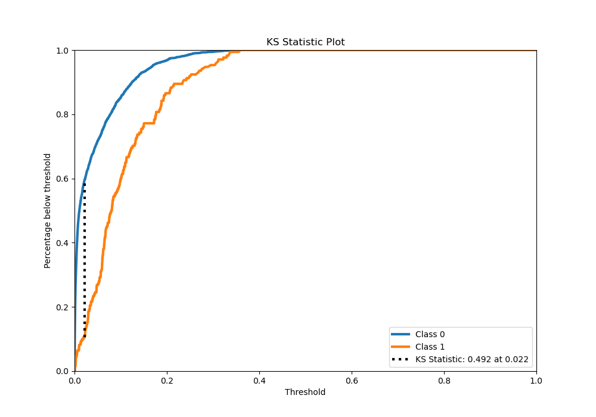
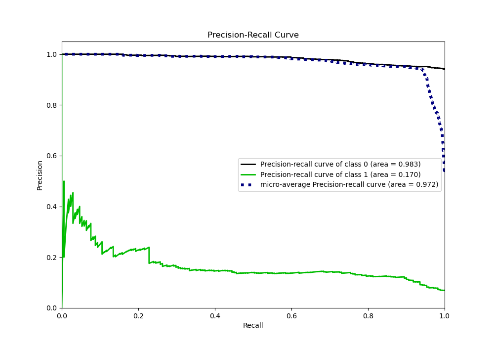
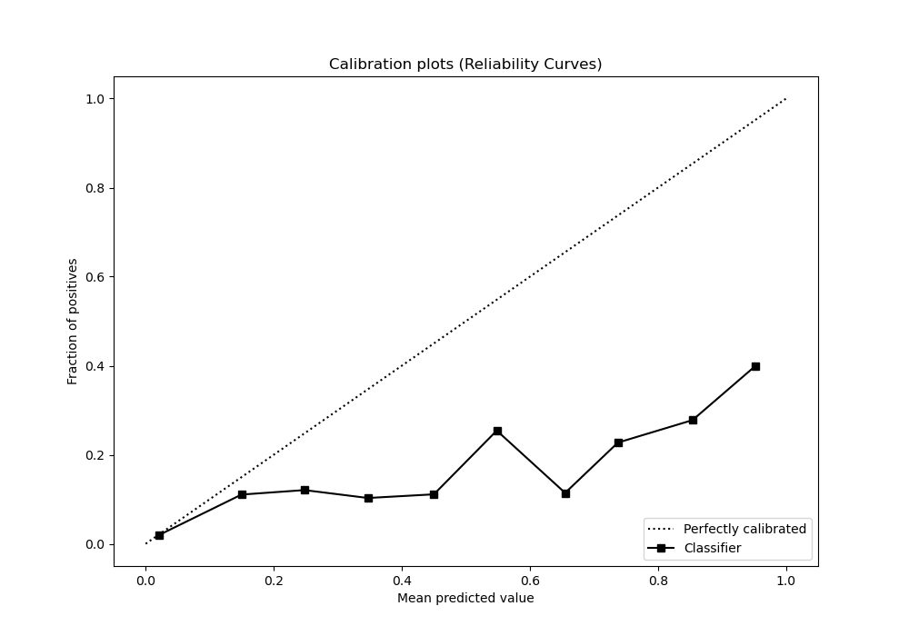
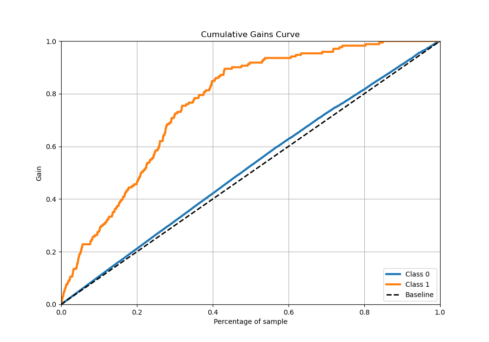
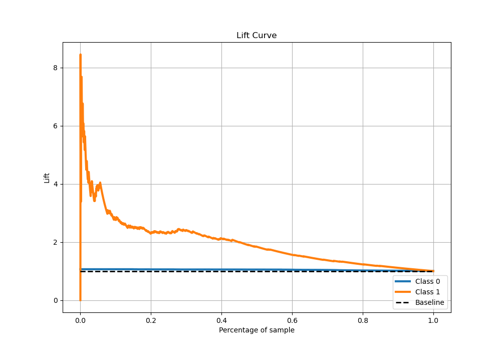

# Summary of 4_Default_NeuralNetwork

[<< Go back](../README.md)

## Neural Network
- **n_jobs**: -1
- **dense_1_size**: 32
- **dense_2_size**: 16
- **learning_rate**: 0.05
- **explain_level**: 2

## Validation
 - **validation_type**: split
 - **train_ratio**: 0.75
 - **shuffle**: True
 - **stratify**: True

## Optimized metric
logloss

## Training time

2.6 seconds

## Metric details
|           |    score |     threshold |
|:----------|---------:|--------------:|
| logloss   | 0.200724 | nan           |
| auc       | 0.781954 | nan           |
| f1        | 0.23671  |   0.0581648   |
| accuracy  | 0.91148  |   0.17378     |
| precision | 0.232704 |   0.17378     |
| recall    | 1        |   1.22952e-06 |
| mcc       | 0.234249 |   0.0221716   |

## Metric details with threshold from accuracy metric
|           |    score |   threshold |
|:----------|---------:|------------:|
| logloss   | 0.200724 |   nan       |
| auc       | 0.781954 |   nan       |
| f1        | 0.224242 |     0.17378 |
| accuracy  | 0.91148  |     0.17378 |
| precision | 0.232704 |     0.17378 |
| recall    | 0.216374 |     0.17378 |
| mcc       | 0.177502 |     0.17378 |

## Confusion matrix (at threshold=0.17378)
|              |   Predicted as 0 |   Predicted as 1 |
|:-------------|-----------------:|-----------------:|
| Labeled as 0 |             2599 |              122 |
| Labeled as 1 |              134 |               37 |

## Learning curves

## Permutation-based Importance

## Confusion Matrix

## Normalized Confusion Matrix

## ROC Curve

## Kolmogorov-Smirnov Statistic

## Precision-Recall Curve

## Calibration Curve

## Cumulative Gains Curve

## Lift Curve

[<< Go back](../README.md)
